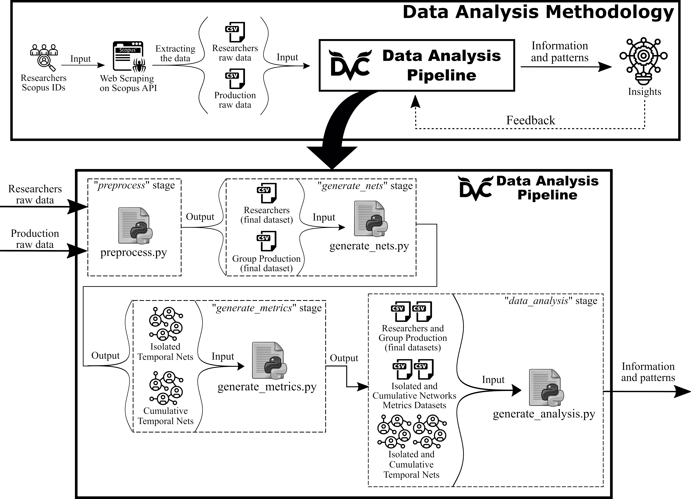

# Methodology for Evaluation and Cohesion Analysis of Research Groups


## Description

This repository is responsible for versioning of the required source code to perform the proposed methodology of evaluation and cohesion analysis of research groups, which has been submitted in the JOI (Journal of Informetrics) journal.

<div align="center">
  
  </br>
  <span> Proposed Methodology for Temporal Evaluation and Cohesion Analysis of Research Groups. </span>
</div>

***

## Environment Setup

To create a conda environment with ``environment.yml``:

```bash
conda env create --file environment.yml
```

To remove an environment in your shell/prompt, run the following command:

```bash
conda remove --name research_group --all
```

To list all available environments, run the following command:

```bash
conda env list
```

To list all packages installed in a environment, run the following command:

```bash
conda list
```

***

## Steps for Definition of Aforementioned Methodology

We will use DVC to manage and version the data processes that produce our results. This mechanism allows you to organize the project better and reproduce your workflow/pipeline and results more quickly.

The following steps are considered:
  1. ``data acquisition``;
  2. ``preprocess``;
  3. ``generate nets``;
  4. ``generate metrics``; and
  5. ``data analysis``.

### 1) Data Acquisition

The updated raw data could be collected by the Jupyter Notebook or Python Script, that are contained into the folder ``data_collection``. Note that the updated raw datasets must be in the folder ``data_analysis_pipeline/data/raw``.

If you choose to include the updated data, it is necessary to track and version the input files. So, you need to run the following commands:

```bash
dvc add data_analysis_pipeline/data/raw/*.csv
git add data_analysis_pipeline/data/.gitignore
git add data_analysis_pipeline/data/raw/*.csv.dvc
```

If you want to use the version used, the raw data are available on [Mendeley Data](https://doi.org/10.17632/rwfd6p6xsd.1). Also, they are contained into the folder ``data_collection/raw_data``.

### 2) Preprocess

To create DVC pipelines, use ``dvc run`` or ``dvc stage add`` to create stages. In each stage, you can define dependencies, parameters, inputs, outputs, and specify the command that is run.

This stage is responsible to perform the tasks of Data Preprocessing, Data Cleaning and Data Wrangling on the raw data. In order to create the ``preprocess`` stage, run the following comand:

```bash
dvc run -n preprocess \
        -d data_analysis_pipeline/data/raw/manuscripts_group.csv \
        -d data_analysis_pipeline/data/raw/members_stats.csv \
        -d data_analysis_pipeline/scripts/preprocess.py \
        -o data_analysis_pipeline/data/prepared/production_members_final.csv \
        -o data_analysis_pipeline/data/prepared/members_stats_final.csv \
        python data_analysis_pipeline/scripts/preprocess.py
```

Finally, to track the changes with Git, run the following comand:

```bash
git add dvc.yaml dvc.lock
```

### 3) Generate Networks

The goal of this stage is to generate temporal networks based on preprocessed data, involving several scenarios of time.

```bash
dvc run -n generate_nets \
        -d data_analysis_pipeline/data/prepared/production_members_final.csv \
        -d data_analysis_pipeline/data/prepared/members_stats_final.csv \
        -d data_analysis_pipeline/scripts/generate_nets.py \
        -o data_analysis_pipeline/data/networks \
        python data_analysis_pipeline/scripts/generate_nets.py
```

Finally, to track the changes with Git, run the following comand:

```bash
git add dvc.yaml dvc.lock
```

### 4) Generate CNA Metrics

Next, from the temporal nets, the CNA main metrics' datasets will be generated for each temporal scenario. The metrics are:

- Betweenness Centrality;
- Degree Centrality;
- Closeness Centrality;
- Eigenvector Centrality;
- Clustering Coefficient;
- Eccentricity; and
- Number of Cliques.

So, the following command creates the ``generate_metrics`` stage:

```bash
dvc run -n generate_metrics \
        -d data_analysis_pipeline/data/prepared/production_members_final.csv \
        -d data_analysis_pipeline/data/networks \
        -d data_analysis_pipeline/scripts/generate_metrics.py \
        -o data_analysis_pipeline/data/prepared/metrics_isolated.csv \
        -o data_analysis_pipeline/data/prepared/metrics_cumulative.csv \
        -o data_analysis_pipeline/data/prepared/metrics_cumulative_2_window.csv \
        -o data_analysis_pipeline/data/prepared/metrics_cumulative_4_window.csv \
        python data_analysis_pipeline/scripts/generate_metrics.py
```

Finally, to track the changes with Git, run the following comand:

```bash
git add dvc.yaml dvc.lock
```

### 5) Data Analysis

The last step (``data_analysis``) performs the necessary analyzes to generate the final output, which it will support in the temporal evaluation and cohesion analysis of research groups. To create the last stage, run the following command:

```bash
dvc run -n data_analysis \
        -d data_analysis_pipeline/data/prepared/production_members_final.csv \
        -d data_analysis_pipeline/data/prepared/members_stats_final.csv \
        -d data_analysis_pipeline/data/networks \
        -d data_analysis_pipeline/data/prepared/metrics_isolated.csv \
        -d data_analysis_pipeline/data/prepared/metrics_cumulative.csv \
        -d data_analysis_pipeline/data/prepared/metrics_cumulative_2_window.csv \
        -d data_analysis_pipeline/data/prepared/metrics_cumulative_4_window.csv \
        -d data_analysis_pipeline/scripts/generate_analysis.py \
        -o data_analysis_pipeline/data/output \
        python data_analysis_pipeline/scripts/generate_analysis.py
```

Finally, to track the changes with Git, run the following comand:

```bash
git add dvc.yaml dvc.lock
```

The final output is several plots, entities clustered by K-Means algorithm, and supplementary data that could support the process of temporal evaluation and cohesion analysis of research groups. Some results generated by the proposed methodology are:
* Plots related to the temporal evaluation of research groups, by using the main metrics of Complex Network Analysis.
* Plots related to the temporal distribution of Connected Components' order, aiming to support the temporal analysis of cohesion in research groups.
* Plots of Time Series of number of Connected Components belonging to scientific teams, in order to support the temporal analysis of cohesion in research groups.
* Clustering of temporal networks belonging to the research groups, by using Graph Embedding Techniques.
* Temporal Clustering of members belonging to the research groups, by using Node Embedding Techniques.

***

## Steps for Execution of Proposed Methodology

For the execution of the following steps, I will consider that you already cloned/downloaded this repository, as well as the steps will be executed via shell/prompt within the folder of this repository. In addition, an essential prerequisite is that DVC is already installed on your machine.

For reusing the raw data that I already collected and the pipeline created, you can do the following steps:

1. Download the raw data, that is available on Data Mendeley, and put them in the ``data_analysis_pipeline/data/raw`` folder. You can download these files from this [link](https://doi.org/10.17632/rwfd6p6xsd.1).

2. Execute the DVC pipeline. So, you can execute the following command:
    ```
    dvc repro
    ```

***

## Citations

[](https://doi.org/10.17632/rwfd6p6xsd.1)

### How to cite the data?

Santos, Breno; Silva, Ivanovitch; Costa, Daniel G. (2022), **Research Group Dataset**, *Mendeley Data*, V1, DOI: 10.17632/rwfd6p6xsd.1.

### How to download the data?

You can download the data on Data Mendeley from this [link](https://doi.org/10.17632/rwfd6p6xsd.1).

<!-- 
[](DOI_PAPER)

### How does it cite?

Santos, Breno Santana; Silva, Ivanovitch; Costa, Daniel G. **A temporal approach to support the evaluation and cohesion analysis of research groups**. *Journal of Informetrics*, 2022 (in submission process).

### How does the article download?

You can download the article from this [link](link).
-->